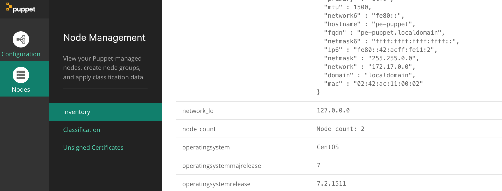

# facecount

## Table of Contents

1. [Overview](#overview)
2. [Setup - The basics of getting started with facecount](#setup)
3. [Usage - Using the new action](#usage)
4. [Limitations - OS compatibility, etc.](#limitations)
5. [Development - Guide for contributing to the module](#development)

## Overview

A Puppet Face to retrieve the node count from PuppetDB.

## Setup

Install the module via Code Manager or r10k and then run Puppet.

## Custom fact
This module includes a custom fact to expose node counts through the Puppet Enterprise Console.  Node counts are available on the Puppet Enterprise Master/Master of Masters on it's inventory page:



This information only makes sense to display for the Puppet Master, so regular agent nodes will display the message 'Available on Puppet Master/MoM only' instead on their individual inventory pages.

## Usage

Once installed and puppet has run, you will have a new action for the `puppet node` subcommand on the Puppet master:

```shell
puppet node count
```

## Limitations

Requires the module to be installed on your Puppet Master and run puppet at least once on the Puppet master before the command becomes available.  Can normally be only run from the Puppet master due to PuppetDB library access.

## Development

Happy for PRs!
